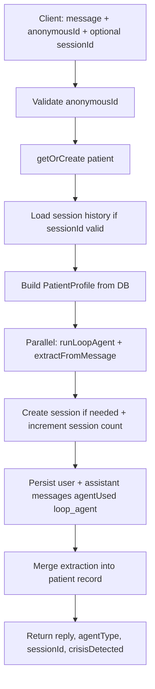

# Sehat Saathi — Backend reference

This document maps **HTTP endpoints**, **Convex functions** (queries, mutations, actions), and the **multi-agent chat flow**. Paths are as implemented in code; Convex HTTP routes are served from your deployment’s site URL (see Convex dashboard → HTTP Actions).

---

## Architecture overview

| Layer | Role |
|--------|------|
| **Convex HTTP router** (`convex/http.ts`) | REST-style routes for auth, sticky notes, JWT chat, admin, health. |
| **Convex functions** | Data + business logic: `query` / `mutation` for DB; `action` for Node + LLM. |
| **Next.js Route Handlers** (`src/app/api/**`) | Appointments proxy to Convex; symptom/medicine tools run in Next (no Convex). |

Auth for HTTP: `Authorization: Bearer <JWT>` where JWT is issued by Convex `jwtNode.signJwt` after email/password login.

---

## Convex HTTP routes

Registered in `convex/http/registerAll.ts`. All paths are relative to the Convex HTTP origin.

### Health

| Method | Path | Implementation |
|--------|------|----------------|
| `GET` | `/api/health` | Returns `{ ok: true, service: "sehat-saathi-convex" }`. |
| `GET` | `/api/chatbot/health` | Runs `internal.chatbotNode.chatbotHealth` — checks `GEMINI_API_KEY` / `OPENAI_API_KEY` presence. |

### Auth (no bearer required)

| Method | Path | Body / behavior | Convex calls |
|--------|------|-----------------|--------------|
| `POST` | `/api/auth/login` | `{ email, password }` — **student** only | `users.getByEmail`, `jwtNode.comparePassword`, `jwtNode.signJwt` |
| `POST` | `/api/auth/login/counsellor` | same | role must be `counsellor` |
| `POST` | `/api/auth/login/admin` | same | role must be `admin` |
| `POST` | `/api/auth/signUp` | student registration fields | `jwtNode.hashPassword`, `users.createStudent` |
| `POST` | `/api/auth/logout` | — | Stateless OK response |

### Sticky notes (JWT)

| Method | Path | Notes |
|--------|------|--------|
| `GET` | `/api/sticky-notes` | List notes for `auth.userId`. |
| `POST` | `/api/sticky-notes` | Create (max 10 per user). |
| `PUT` | `/api/sticky-notes/:id` | Update fields from JSON body. |
| `PUT` | `/api/sticky-notes/:id/bring-to-front` | Z-order. |
| `DELETE` | `/api/sticky-notes/:id` | Soft delete. |

Uses `internal.stickyNotes.*`.

### User chat (JWT)

| Method | Path | Body | Implementation |
|--------|------|------|----------------|
| `POST` | `/api/user/chat/ai` | `{ message, sessionId? }` | `anonymousId = "jwt:" + userId`, then `internal.patientChat.runTurn` (full agent pipeline). |
| `POST` | `/api/user/chat/peer-to-peer` | — | Placeholder text response. |
| `POST` | `/api/user/chat/counsellor` | — | Placeholder text response. |

### Counsellor (JWT, role `counsellor`)

| Method | Path | Notes |
|--------|------|--------|
| `GET` | `/api/counsellor/getUser` | Placeholder plain-text response. |

### Admin — students (JWT, role `admin`)

| Method | Path | Implementation |
|--------|------|----------------|
| `GET` | `/api/admin/user` | `internal.users.listStudents` |
| `PUT` | `/api/admin/user/:id` | Optional password → `jwtNode.hashPassword`, `users.updateStudent` |
| `DELETE` | `/api/admin/user/:id` | `users.deleteStudent` |

### Admin — counsellors (JWT, role `admin`)

| Method | Path | Implementation |
|--------|------|----------------|
| `GET` | `/api/admin/counsellor` | `internal.users.listCounsellors` |
| `POST` | `/api/admin/counsellor` | Validate body → `jwtNode.hashPassword`, `users.createCounsellor` |
| `PUT` | `/api/admin/counsellor/:id` | `users.updateCounsellor` |
| `DELETE` | `/api/admin/counsellor/:id` | `users.deleteCounsellor` |

---

## Convex public functions (client / `useQuery` / `useMutation` / `useAction`)

These are exported from Convex modules and callable via `api.*` (not `internal.*`).

| Module | Function | Type | Purpose |
|--------|----------|------|---------|
| `patientChat` | `sendMessage` | **action** | Anonymous/client chat turn: same pipeline as `runTurn` but public. Args: `anonymousId`, optional `sessionId`, `message`, optional `language`. |
| `patients` | `getOrCreatePatient` | mutation | Ensure patient row by anonymous id. |
| `patients` | `getProfileByAnonymousId` | query | Read patient profile by anonymous id. |
| `sessions` | `getSessionForPatient` | query | Session for a patient + session id. |
| `sessions` | `getPatientSessions` | query | List sessions for patient. |
| `guestAppointments` | `createGuest` | mutation | Insert guest appointment. |
| `guestAppointments` | `listRecent` | query | Recent appointments (bounded limit). |
| `dashboard` | `getOverview` | query | Mood + session summary for `subjectKey` (anonymous id). |
| `helplines` | `listByRegion` | query | Helplines filtered by region. |
| `counsellors` | `ensureByClerkId` | mutation | Upsert counsellor from Clerk id. |
| `counsellors` | `getByClerkId` | query | Lookup by Clerk user id. |
| `adminCounsellors` | `listCounsellors` | query | Clerk-backed counsellor directory. |
| `adminCounsellors` | `deleteCounsellor` | mutation | Remove counsellor doc. |
| `adminCounsellors` | `createCounsellor` | **action** | Create with optional search indexing (see module). |
| `adminCounsellors` | `updateCounsellor` | **action** | Update + optional search. |

**Internal-only** helpers (HTTP/actions call these): `users.*`, `sessions.*`, `patients.*`, `stickyNotes.*`, `jwtNode.*`, `patientChat.runTurn`, `chatbotNode.chatbotHealth`, `seed.*`, `helplines.seedHelplinesOnce`.

---

## Next.js API routes (`src/app/api`)

Served on the Next.js app origin (e.g. `http://localhost:3000/api/...`).

| Route | Methods | Implementation |
|-------|---------|----------------|
| `/api/appointments` | `GET`, `POST` | `ConvexHttpClient` → `api.guestAppointments.listRecent` / `createGuest`. |
| `/api/symptom-check` | `POST` | `runSymptomCheck` in `@/lib/symptomCheck` (local logic + disclaimer). |
| `/api/medicines` | `GET` | Query `q` → `searchMedicines` on local dataset. |
| `/api/verify-medicine` | `POST` | Multipart `image` → Tesseract OCR → `matchMedicineFromText`. |

---

## Chat agent: LangGraph loop + tools

Chat turns are implemented in `convex/patientChat.ts` (`executeTurn`), used by:

- **Public action** `sendMessage` (e.g. Convex React client, anonymous id).
- **Internal action** `runTurn` (JWT HTTP route uses `jwt:${userId}` as anonymous id).

### End-to-end turn flow

### Single ReAct agent (`convex/lib/chatAgentGraph.ts`)

- Built with **`createReactAgent`** from `@langchain/langgraph/prebuilt`.
- **One** chat model (same env as below) runs a **tool loop** until it responds without tool calls or the graph **recursion limit** is hit.
- **Tools** (native to the agent, not hard-coded prefetch):
  - **`exa_search`** — wraps [`exaSearch`](convex/lib/search.ts) (patient `conditions` injected from profile).
  - **`apify_search`** — wraps [`apifyWebSearch`](convex/lib/search.ts).
- **System prompt** encodes Saathi behavior (support, screening-style tone when needed, crisis helplines, India/Kashmiri student context). There are no separate empathy/crisis/resource modules.

### Loop budget (Convex env)

| Variable | Default | Meaning |
|----------|---------|---------|
| `CHAT_AGENT_MAX_ITERATIONS` | `5` | Target cap on agent “rounds”; mapped to LangGraph `recursionLimit` as **`2 * max + 4`** (minimum 4) so tool cycles do not hit the limit prematurely. Set on the **Convex** deployment. |

### Parallel extraction (`convex/agents/extraction.ts`)

While **`runLoopAgent`** runs, **`extractFromMessage`** (still uses `convex/lib/llm.ts` `chat()` with JSON) extracts: conditions, medications, triggers, coping patterns, crisis flag, mood score, dominant emotion, optional PHQ hint. Results feed **`patients.updateFromExtraction`** so the next turn’s `PatientProfile` is richer.

### LLM provider (chat agent vs extraction)

- **Loop agent**: `ChatGoogleGenerativeAI` or `ChatOpenAI` from LangChain inside [`chatAgentGraph.ts`](convex/lib/chatAgentGraph.ts) — same env vars: default **Gemini** (`GEMINI_API_KEY`, `GEMINI_MODEL`), or `LLM_PROVIDER=openai` with `OPENAI_API_KEY` / `OPENAI_MODEL`.
- **Extraction** (and any other `chat()` callers): [`convex/lib/llm.ts`](convex/lib/llm.ts) as before.

---

## Chat pipeline tracing (Convex)

Set in the **Convex** deployment environment (Dashboard → Settings → Environment variables), not only in Next.js:

| Variable | Effect |
|----------|--------|
| `SEHAT_CHAT_TRACE=1` | Emits structured `console.log` lines prefixed with `[sehat_chat]` plus JSON: turn lifecycle, `llm_call_end` (per legacy `chat()` call: extraction etc.), `extraction_done`, **`loop_agent_done`** (tool call names/count, recursion limit), etc. Each turn shares a `turnId` (UUID). |
| `SEHAT_CHAT_TRACE_VERBOSE=1` | Also logs a short user `messagePreview` (80 chars) on `turn_start` and full extraction arrays on `extraction_done`. **Avoid in production** if messages are sensitive. |

**Where to read logs:** Convex dashboard → your deployment → **Logs**, while exercising `patientChat.sendMessage` or HTTP chat routes.

**Example lines:** `[sehat_chat] {"event":"loop_agent_done","toolCalls":["exa_search"],...}` and `[sehat_chat] {"event":"llm_call_end","call":"extraction",...}`

Implementation: [`convex/lib/chatTrace.ts`](convex/lib/chatTrace.ts), [`convex/patientChat.ts`](convex/patientChat.ts), [`convex/lib/chatAgentGraph.ts`](convex/lib/chatAgentGraph.ts), [`convex/lib/llm.ts`](convex/lib/llm.ts), [`convex/lib/search.ts`](convex/lib/search.ts), [`convex/agents/extraction.ts`](convex/agents/extraction.ts).

---

## Related files (quick index)

- HTTP wiring: `convex/http.ts`, `convex/http/registerAll.ts`, `convex/http/routes/*.ts`, `convex/http/common.ts`
- Chat: `convex/patientChat.ts`, `convex/lib/chatAgentGraph.ts`, `convex/agents/extraction.ts`, `convex/agents/types.ts`, `convex/lib/llm.ts`, `convex/lib/search.ts`, `convex/lib/chatTrace.ts`
- Schema: `convex/schema.ts`
- JWT/password: `convex/jwtNode.ts`
